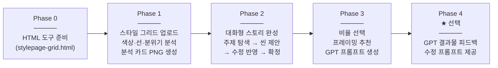

# 🎨 style-page-by-blue — 미드저니 스타일을 GPT로 이식하는 스킬

> 미드저니 sref 스타일 그리드 이미지를 분석하고, 대화로 스토리를 완성한 뒤, GPT 이미지 생성용 프롬프트를 만들어주는 Claude Cowork 스킬

유튜브 → [@mjKorea123](https://www.youtube.com/@mjKorea123)

<p>


</p>

---

## 이게 뭔가요?

미드저니에서 마음에 드는 sref 스타일을 발견했는데, GPT로도 비슷하게 만들고 싶다면 — 이 스킬이 그 다리 역할을 합니다.

sref 스타일 그리드 이미지를 올리면 색상·선 스타일·분위기를 분석하고, 어떤 내용을 담고 싶은지 대화로 완성한 뒤, GPT에 바로 넣을 수 있는 완성 프롬프트를 만들어줘요.

---

## 파이프라인 구조



---

## 주요 기능

### 🔍 스타일 분석
sref 그리드 이미지에서 다음 항목을 추출해요.

- 지배적인 색상 5개 (Primary / Secondary / Accent / Background / Outline)
- 선 스타일 (굵기, 선명도, 표현 방식)
- 텍스처 (구아슈 / 아크릴 / 수채 / 디지털 등)
- 분위기 키워드 3개
- 스타일 유형 분류

분석 결과는 **PNG 카드로 저장**할 수 있어요 (`style_analysis_[sref코드].html` 생성).

### 💬 대화형 스토리 완성
"어떤 내용을 담고 싶으세요?" 한 마디에서 시작해서 씬 제안 → 피드백 반영 → 확정까지 대화로 완성해요. 인물이 없어도 강력한 씬을 만들 수 있어요.

### 📐 비율 & 프레이밍 선택
결과물 비율 3종 중 선택 후, 스타일과 스토리에 맞는 프레이밍을 추천해줘요.

| 비율 | 용도 |
|------|------|
| 1:1 정사각형 | SNS 피드, 균형 잡힌 구성 |
| 4:3 가로형 | 넓은 씬, 배경 강조 |
| 3:4 세로형 | 포스터, 세로 피드 |

### 📝 완성 프롬프트 생성
스타일 레퍼런스 지시, 컬러 팔레트, 콘텐츠 배정, 레이아웃 제어까지 포함된 GPT 프롬프트를 한 번에 생성해요. 복사해서 GPT에 붙여넣기만 하면 돼요.

### 🔄 GPT 결과 피드백 (선택)
결과물 이미지를 올리면 스타일 재현도, 컬러 충실도, 구조 바이어스 등을 분석하고 수정 프롬프트를 전체 다시 작성해줘요.

---

## 현실적인 기대치

미드저니와 GPT는 이미지를 만드는 미학 모델 자체가 달라요.

| 상황 | 수준 |
|------|------|
| 미드저니 원본 | 100 |
| GPT 기본값 (스타일 참조 없음) | 10 |
| **이 스킬 사용 시** | **40~50** |

선의 생동감, 색의 의도성, 여백의 감각 같은 미드저니 특유의 미학은 구조적으로 완전 재현이 어려워요. 하지만 텍스트 삽입, 구조 제어 같은 GPT의 장점과 결합하면 충분히 의미 있는 결과물이 나와요.

---

## 이렇게 말하면 돼요

```
"스타일페이지 시작"
"sref 코드 있어"
"미드저니 스타일로 만들어줘"
"GPT 프롬프트 뽑아줘"
"sref 1792533187로 만들어줘"
"style-page 시작"
```

---

## 사용 순서

1. `stylepage-grid.html`을 브라우저에서 열어요
2. sref 코드(숫자)를 입력 → 9장 스타일 이미지 자동 로드
3. **[Download All as One]** 버튼으로 그리드 PNG 저장
4. 스킬에 그리드 PNG + sref 코드를 함께 올리면 시작!

> ⚠️ `stylepage-grid.html`은 반드시 **Chrome / Safari 등 브라우저**에서 열어야 해요.
> Cowork 내부 뷰어에서 열면 이미지가 로드되지 않아요.

---

## 설치 방법

1. 이 저장소를 다운로드합니다
2. `style-page-by-blue/` 폴더를 Claude Cowork의 플러그인 폴더에 복사합니다
3. Cowork를 재시작하면 스킬이 활성화됩니다

---

## 요구 사항

- **Claude Cowork** 데스크톱 앱
- **미드저니** — sref 스타일 그리드 생성용
- **ChatGPT** — 생성된 프롬프트로 이미지 생성

---

## 만든 사람

**Blue (조남경)** — 미드저니 코리아
유튜브 [미드저니 코리아 조남경](https://www.youtube.com/@mjKorea123) | 커뮤니티 [미드저니 코리아](https://www.facebook.com/groups/midjourneykorea)
